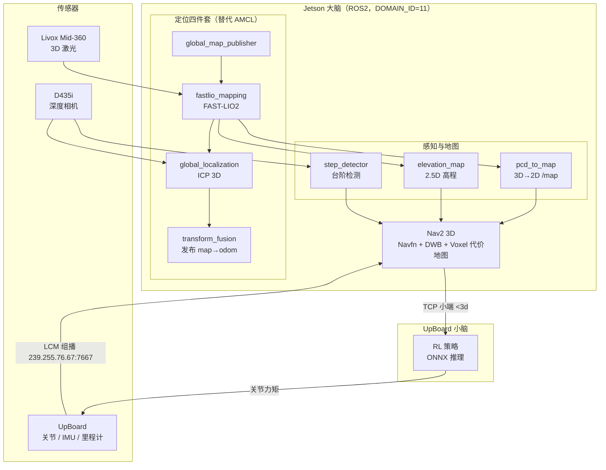

# 轮腿式机械狗项目 (dog_ws)

> **16-DOF 轮腿式机械狗（Mini Cheetah 构型）**，Jetson Orin NX 大脑 + UpBoard 小脑。
> 全链路已打通并实测验证：FAST-LIO2 建图 → ICP 3D 全局定位 → Nav2 3D 导航 → TCP 小端指令 → UpBoard RL 策略驱动运动。

> **2026-09-04 当前基线**：控制链为 R18（`lock_sec=0.3s` + 反向衰减 30% + 先方向锁后抬底），仍属待完成三组实车对照的实验基线，不得写成“已稳定验证”。R19 只做静态可证明的可靠性修复，未改变 R18 控制参数。详见《技术架构与调参》R19 记录。

## 文档结构（2026-08-27 由 9 份整理为 3 份）

| 文档 | 内容 |
|------|------|
| `README.md`（本文） | 入口：概述 / 架构 / 硬件网络 / 环境构建 / 快速启动 |
| `技术架构与调参.md` | 完整架构 + 数据流 + TF/Topic + 参数 + RViz + 设计决策 + 演进记录 + 启动速查 + Nav2 调参日志 |
| `运维与状态文档.md` | 当前真实状态 + 运维指南 + 网络维护 + systemd + 故障速查 + 任务清单 + 安全红线 |
| `docs_backup_20260827/` | 整理前 9 份原始文档的完整备份 |

> ⚠️ **重要更正（2026-08-28 更新）**：
> 1. Nav2 DWB critics 旧写法从未生效（历史「调优已完成」记录作废），已改嵌套写法。
> 2. 体素层 z 窗口已修复（R4，-0.75~1.65m，垂直分辨率 0.15）。
> 3. **B1 TF 时间戳对齐已回退（R7）**：B1 修改（odom.header.stamp）虽消除启动期 extrapolation，但引入 1.3~1.5s 全链路延迟，导致 ICP pitch 异常、z 漂移、costmap 跟不上。已回退为 get_clock().now()，回退后延迟稳定 21~43ms，z/pitch 稳定，out of bounds=0。
> 4. **z 漂移根因已定位并解决**：之前认为是 ICP 非零 pitch 与水平运动耦合（R6），经逐层实验（A→B1→B2→回退）证明：pitch 异常和 z 漂移都是 B1 修改引入延迟的**后果**，不是独立根因。回退 B1 后 pitch 稳定在 -1.2°~-0.1°，z 稳定在 0.24~0.48m。
> 5. **遗留问题**：planner_server 有少量 goal 时间戳过旧的 extrapolation（约 0.08 条/s），不影响 costmap 和避障，待后续处理。

## 目录
- [项目概述](#项目概述)
- [系统架构](#系统架构)
- [硬件平台与网络](#硬件平台与网络)
- [工作空间结构](#工作空间结构)
- [环境配置与构建](#环境配置与构建)
- [快速启动](#快速启动)
- [典型工作流](#典型工作流)

## 项目概述

机械狗在实验室等结构化场景内完成**自主建图**与**自主导航**：

- **建图模式（mapping）**：FAST-LIO2 激光-惯性里程计实时建图，产出 3D 点云地图（PCD）。
- **导航模式（navigation）**：基于已有 3D 地图，用 ICP 3D 全局定位（替代 AMCL）+ Nav2 3D 导航栈规划并下发速度指令，驱动狗体运动到目标。

## 系统架构

```
传感器           建图/定位              规划/导航             执行
Livox Mid-360  →  FAST-LIO2          →  Nav2 3D          →  TCP 小端指令
D435i 深度相机  →  ICP 3D 全局定位     →  (Navfn + DWB     →  UpBoard 小脑
                 (四件套替代 AMCL)       + Voxel 代价地图)    RL 策略驱动运动
```

- **定位四件套**：global_map_publisher → fastlio_mapping → global_localization → transform_fusion（发布 map→odom，持绝对定位权）。
- **地图双流 + 感知**：pcd_to_map（3D→2D /map）+ elevation_map（2.5D 高程）+ step_detector（D435i 台阶检测）。
- **桥接**：lcm_bridge 负责 LCM（UpBoard→Jetson 里程计/IMU/关节）与 TCP（Jetson→UpBoard 速度，小端 `<3d`）。

### 数据流全景



## 硬件平台与网络

| 接口 | IP | 用途 |
|------|-----|------|
| `wlP1p1s0`（WiFi） | 192.168.31.91/24 | 主网络 / SSH / 上网 |
| `enx00e04c680779`（USB 网卡） | 192.168.1.100/32 | Mid-360 雷达直连 |
| `enP8p1s0`（有线） | 10.0.0.48/24 | UpBoard 底盘直连 |

| 设备 | 地址 | 通信 |
|------|------|------|
| Jetson 大脑 | nvidia@192.168.31.91 | SSH |
| UpBoard 小脑 | 10.0.0.6 | LCM 组播 239.255.76.67:7667 + TCP :3333 |
| Mid-360 雷达 | 192.168.1.195 | USB 网卡直连（数据口 56301/56401） |
| D435i 相机 | — | USB3 直连（必须 USB 3.0 线，否则降 14Hz） |

## 工作空间结构（6 个包）

```
dog_ws/src/
├── dog_brain/             # 大脑：建图/导航双模式编排 + Nav2 配置 + 地图
├── dog_description/       # URDF + STL 模型（19 link / 18 joint）
├── dog_sensors/           # 传感器 launch：D435i + Mid-360（含 mid360_config.json）
├── lcm_bridge/            # UpBoard↔ROS2 桥接 + TCP 速度下发
├── livox_ros_driver2/     # Livox 雷达驱动（已合并，含时间戳补偿补丁）
└── fast_lio_localization/ # FAST-LIO2 建图 + ICP 定位四件套 + 感知节点
```

## 环境配置与构建

```bash
# 每个新终端先加载环境（ROS_DOMAIN_ID=11 已在 ~/.bashrc）
source /opt/ros/humble/setup.bash
source /home/nvidia/dog_ws/install/setup.bash

# 构建（单工作空间，symlink-install：Python/launch/config 改后无需重 build，C++ 需重 build）
cd /home/nvidia/dog_ws
colcon build --symlink-install
```

## 快速启动

```bash
# 建图模式：FAST-LIO2 SLAM + 传感器 + LCM 桥接
ros2 launch dog_brain mapping_launch.py

# 导航模式：ICP 3D 定位 + Nav2 3D 导航（自动清理残留节点）
bash /home/nvidia/nav_restart.sh
# 或
ros2 launch dog_brain navigation_launch.py
```

分模块启动（传感器 / 单雷达 / 单相机 / LCM 桥接）、调试命令、IP/端口/Topic 速查，见 `技术架构与调参.md` 附录 D。

## 典型工作流

```bash
# ① 建图
ros2 launch dog_brain mapping_launch.py        # 静止 5~10s 让 IMU 初始化，遥控走一圈

# ② 保存 3D 地图
ros2 service call /map_save std_srvs/srv/Trigger   # 产出 ./test.pcd，重命名保留

# ③ 部署到导航地图
# 将 PCD 复制到 src/dog_brain/maps/lab_3d_map.pcd，并 ln -sf 到 install（见技术文档建图章节）

# ④ 导航
bash /home/nvidia/nav_restart.sh               # 设初始位姿 → RViz 发目标 → 狗体运动
```

> 运维细节、故障处置、当前任务与完成度，见 `运维与状态文档.md`。
> 动 UpBoard / 狗体前，务必遵守 `运维与状态文档.md` 中的安全红线。

## 归属与许可证

⚠️ **本仓库根目录没有 `LICENSE` 文件**，因此不声明统一的项目许可证。
各包的授权状态以各自 `package.xml` 中的 `<license>` 字段为准：

| 包 | `package.xml` 中的声明 |
|---|---|
| `dog_brain` | `MIT` |
| `dog_description` | `MIT` |
| `dog_sensors` | `MIT` |
| `lcm_bridge` | `MIT` |
| `livox_ros_driver2` | `MIT` |
| `fast_lio_localization` | `BSD` |

### 上游第三方包（权利归原作者）

| 包 / 组件 | 来源与归属 |
|---|---|
| `livox_ros_driver2` | **Livox（览沃科技）** 官方雷达驱动；本仓库内已合并并加入时间戳补偿补丁 |
| `fast_lio_localization` | 基于 **FAST-LIO2**（HKU MARS Lab，BSD）与 ICP 全局定位的二次开发 |
| `fastdds_udp.xml` | Fast DDS 通信配置（eProsima Fast DDS，Apache-2.0） |
| `robot2_adapter.py` / `robot2-adapter.service` | 多机协同上行适配器（本项目自研） |

> 建议：若要对外声明 MIT，请补充根目录 `LICENSE` 文件，并把各包 `package.xml`
> 中缺失的许可证字段补全。

### 硬件与安全提示

- 本项目控制的是**真实四足机器人**（16-DOF 轮腿构型），涉及大扭矩执行器与实时控制，
  调试时请确保场地安全、急停可用。
- README 中的控制参数基线（如 R18）**仍在实车对照验证中**，请勿当作已稳定结论使用。
